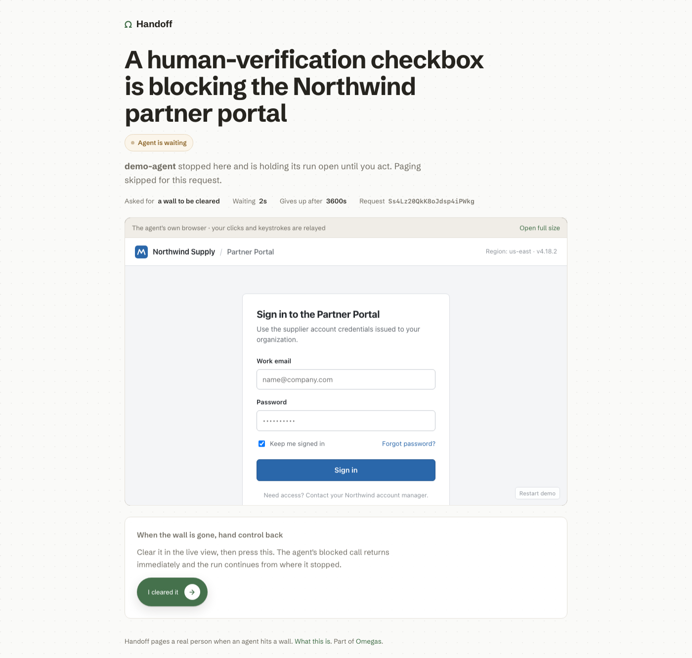
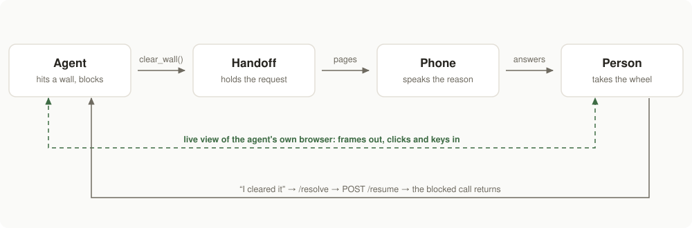
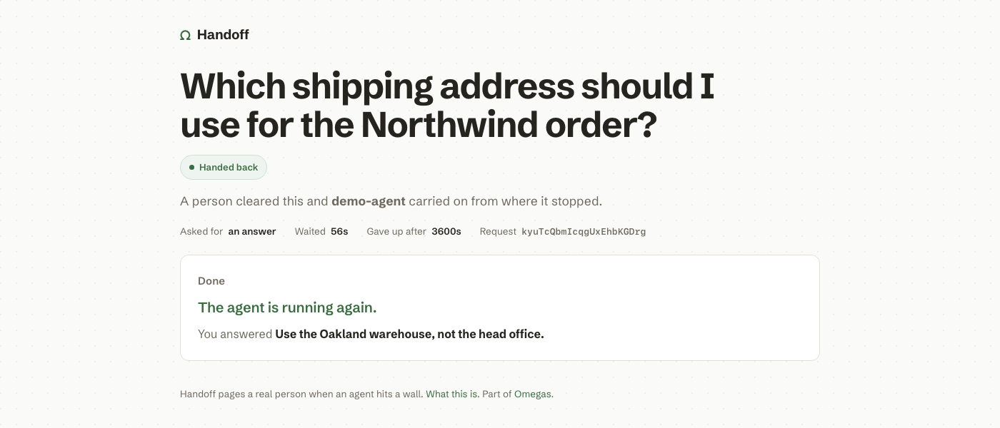
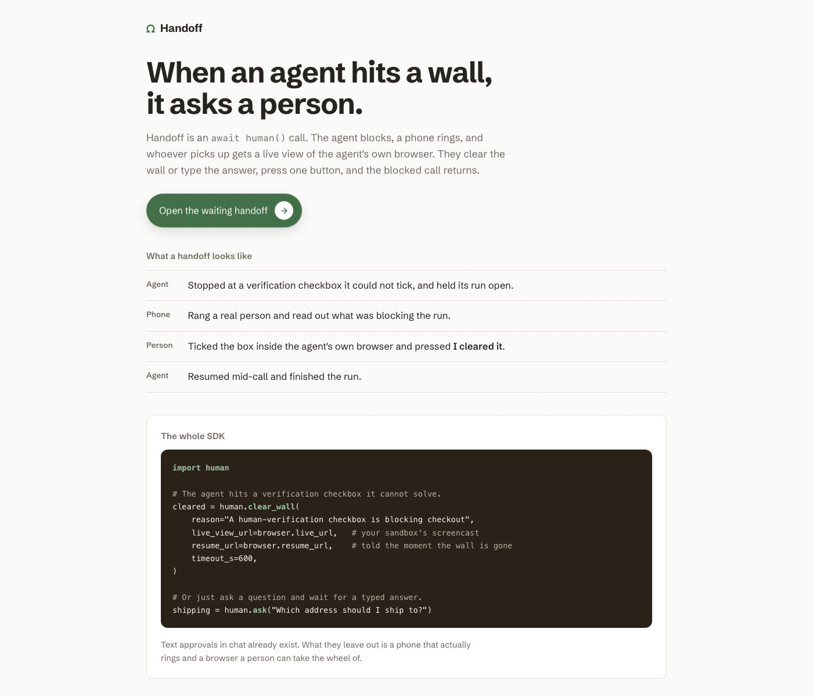

<h1 align="center">Handoff</h1>

<p align="center">
  <strong>An <code>await human()</code> API for AI agents.</strong><br>
  When an agent hits a wall it cannot pass, a real human's phone rings, the human takes the wheel<br>
  in the agent's live browser, clears the wall, and the agent's blocked call returns.
</p>

<p align="center">
  <a href="https://handoff.omegas.dev/try"><strong>Try it</strong></a> &nbsp;·&nbsp;
  <a href="https://handoff.omegas.dev">Live</a> &nbsp;·&nbsp;
  <a href="https://github.com/OmegaAgent/handoff">Source</a> &nbsp;·&nbsp;
  <a href="LICENSE">MIT</a> &nbsp;·&nbsp;
  Python 3.12
</p>

<p align="center">
  
</p>

<p align="center">
  <sub>A real blocked handoff in production. The agent stated why it stopped, and the person can act
  inside its browser and hand control back.</sub>
</p>

---

## The 10-line version

The SDK is one file. `pip install -e .`, or copy `human/` into your project.

```python
import human

human.configure(base_url="https://handoff.omegas.dev")   # or set HANDOFF_URL

# Ask a question. Blocks until a human answers; returns their text.
address = human.ask("Which shipping address should I use?", timeout_s=600)

# Hand off a wall. Blocks until a human clears it; returns True if they did.
cleared = human.clear_wall(
    reason="Cloudflare Turnstile checkbox is blocking checkout",
    live_view_url="https://<sandbox>/live?token=<hex>",
    resume_url="https://<sandbox>/resume",
    resume_token="<hex>",
    timeout_s=600,
)
```

Both calls block by long-polling the API, so a human's decision arrives as an ordinary function
return. `live_view_url` and `resume_url` are optional: pass them when your agent drives a browser
you want the human to touch, and the handoff page embeds that live view. Lower level, if you want
to own the waiting: `req = human.create_request(...)` then `req.wait(timeout_s=600)`.

## The problem

Agents fail at walls: a CAPTCHA, a 2FA code, a login form, a judgment call the agent has no
standing to make. The usual answers are to retry harder or to give up and write a line in a log,
which ends the run and discards everything the agent already did. Handoff takes the third option,
which is to ask a person and hold the run open while they help.

## Why this and not a Slack approval

humanlayer.dev, gotoHuman, and LangGraph interrupts all have one shape: a text approval in chat.
Handoff does the two things they do not.

- **Physical paging.** The phone rings and a voice reads the agent's reason out loud, so the human
  is reachable away from a keyboard.
- **Live browser takeover.** The human acts *inside* the agent's own browser session, with mouse
  and keyboard relayed to it, then hands control back. A chat approval cannot tick a Turnstile box.

inkbox.ai (YC S26) runs the opposite direction, giving the agent its own identity and comms. That
is complementary, not competing.

## How it works

<p align="center">
  
</p>

1. The agent hits a wall and calls `human.clear_wall(...)` or `human.ask(...)`. The call blocks.
2. The SDK POSTs `/v1/requests` with the agent's reason, plus the live-view and resume URLs for the
   browser it is driving.
3. The API pages a human by phone through Retell AI. The voice states the reason and points at the
   handoff link.
4. The human opens `/r/{id}`: the reason, the context, and a live view of the agent's real browser
   (CDP screencast frames over a WebSocket, input relayed back), so they can drive it rather than
   only watch.
5. The human clears the wall or types an answer, then presses "I cleared it". That hits `/resolve`,
   which POSTs the agent browser's `resume_url`.
6. The blocked long-poll returns with `cleared=True` or the typed answer, and the run continues
   from where it stopped.

The live view is a direct connection between the human's page and the agent's browser sandbox. The
API holds the request, rings the phone, and carries the resolution back.

<details>
<summary>The same flow as a sequence, for reading in a terminal</summary>

```
 agent + browser      handoff API       phone        human
        |                   |             |            |
        |-- clear_wall() -->|             |            |
        |     (blocks)      |-- rings --->|            |
        |                   |             |-- opens -->|
        |                   |<------ GET /r/<id> ------|
        |                   |             |            |
        |<==== live view: frames out, clicks in =======|
        |                   |<-- "I cleared it" -------|
        |<-- POST /resume --|             |            |
        |-- poll returns -->|             |            |
        |  run continues    |             |            |
```

</details>

Once the person acts, the same page records what happened and the run carries on:

<p align="center">
  
</p>

## The gate that makes the demo honest

`GET /demo/statement?handoff=<id>` returns the demo's rebate statement only when a real human has
resolved that exact handoff id. Otherwise it returns 403.

It exists because serving the demo wall's HTML also serves the numbers inside it. An agent could
regex the total straight out of the page and never need a person, and the demo would prove nothing.
So the payoff sits behind an endpoint the agent cannot open by itself: it holds the handoff id, but
nothing within its reach can resolve that id. Only the human who answered the phone can.

The gate holds against the real deployment, not just in theory. Ten of ten assertions passed against
production: the 403 while pending names the state as `pending` rather than an unknown handoff, the
agent process was confirmed still blocked while it waited, and the wall was checked as production
serves it over HTTPS rather than over `file://`. There, a scripted `.click()` is still rejected and
only a trusted CDP click reveals the payoff.

## Verified in production

Measured tonight against the deployed server, not on a laptop:

- **The long-poll returns on the human's click.** A real resolution came back in 3 seconds against
  a 25-second wait window, so the agent resumes when the person acts, not on a polling tick.
- **`POST /resume` lands on the browser sandbox** with its bearer token.
- **A real phone call fired from the deployed server** through Retell AI.
- **The demo agent's `--scripted` mode ran the whole loop end to end** and read the payoff only
  after a human cleared the wall: `GET /demo/statement` returned 403 while the handoff was pending
  and 200 once it was resolved. Ten of ten assertions passed, including that the agent was still
  blocked while it waited.
- **The live view works from a foreign origin** because the sandbox serves `/live` with the token as
  a query parameter, returns 401 without it, and sets neither `X-Frame-Options` nor a CSP. Frames go
  out and clicks come in over the same socket, so the human drives.

## Limitations, stated plainly

- **State lives in one process on one machine.** The app is pinned to a single machine on purpose:
  with two, a request created on one is unknown to the other.
- **A redeploy drops pending requests.** Durable state is first on the roadmap.
- **No auth beyond unguessable ids.** The handoff page is public to whoever holds the link.
- **Anyone holding the API URL can ring the owner's phone.** Request creation has no key yet.
- **`--claude` mode is not proof of the gate.** The Bedrock-backed agent mode runs, but it is fed
  the stripped page text, which exposes the template contents. `--scripted` is the honestly gated
  mode, and it is the one measured above.

## How judges can test it

Open **https://handoff.omegas.dev/try**. It mints a demo handoff and redirects you straight to
`/r/<id>`, the exact page a paged human sees: the agent's stated reason, the live view of its
browser, and the resolve control. Resolving there is what unblocks the agent and what opens the
gated statement.

Paging is off on that self-serve path, on purpose. A public button that rings a real person's phone
is a public button for waking someone up. We also publish no `curl` that pages, since that would put
a working key in the wild. The phone leg is shown in the live demo and in the backup video.

<p align="center">
  
</p>

<details>
<summary><strong>Full HTTP API</strong></summary>

<br>

| Endpoint | Purpose |
|---|---|
| `GET /healthz` | Liveness. Returns `{"ok": true}`. |
| `POST /v1/requests` | Create a handoff request. `kind` is `clear_wall` or `question`; body carries `reason`, `question`, `agent`, optional `live_view_url` / `resume_url` / `resume_token`, `timeout_s`, and `page` (set `false` to skip phone paging). Returns `201` with the id and its public `page_url`. |
| `GET /v1/requests/{id}?wait=25` | Long-poll. Returns as soon as status leaves `pending`, or after `wait` seconds. Carries `status`, `answer`, `cleared`, `resolved_by`, and timestamps. |
| `POST /v1/requests/{id}/resolve` | Resolve one request: `{"answer", "cleared", "by"}`. Side effect: if the request carried a `resume_url`, the server POSTs it with `resume_token` as a bearer. |
| `GET /r/{id}` | The public handoff page for one request. No auth; the id is a 22-character unguessable string. |
| `GET /demo/statement?handoff=<id>` | The demo payoff, gated: `200` only after a human resolved that handoff id, `403` otherwise. |
| `GET /try` | Self-serve demo. Mints a handoff with paging off and `303`-redirects to its `/r/<id>` page. |
| `GET /` | Landing and status page. |

Request state is held in the server process, in memory. Deliberate for a four-hour build, and the
first thing to replace.

</details>

<details>
<summary><strong>What existed before tonight, and what did not</strong></summary>

<br>

Built solo at founders.inc Night Hack on 2026-07-24, in under four hours.

**Existed before:** Omega's internal browser-agent infrastructure. Fly.io / Sprites microVM
sandboxes that rent a browser with a CDP endpoint; an in-sandbox live-view service streaming CDP
screencast frames over a WebSocket with input relayed back; HMAC viewer-token minting; a
sandbox-level `request_human_help(reason)` action whose clearance was *inferred* from the page url
or title changing; and a `POST /resume` endpoint that nothing ever called. Personal accounts for
Retell AI, Fly.io, Cloudflare, and AWS Bedrock predate the event too.

**Built tonight:** the entire standalone product. The `human` SDK, the hosted API (create,
long-poll, resolve), the public handoff page, phone paging through Retell AI, the demo wall, the
gated `/demo/statement`, and the `"I cleared it"` to `POST /resume` path.

That last one closed a real gap. Inferring clearance from url or title movement silently misses
walls cleared in place: a human ticks a Turnstile checkbox, nothing about the page identity changes,
and the agent waits until its deadline. `POST /resume` existed but had no caller anywhere. Clearance
stopped being a guess and became a stated fact.

Full detail in [DISCLOSURE.md](DISCLOSURE.md).

</details>

## Sponsor tools used

- **Anthropic Claude** as the demo agent's brain, called through **AWS Bedrock** (no direct
  Anthropic API credits were available, so Bedrock carried the model).
- **Retell AI** places the phone call and speaks the agent's reason.
- **Fly.io** hosts the API and the handoff page.
- **Cloudflare** for DNS on `handoff.omegas.dev`.

## Where this goes

Handoff is meant to become the layer between an agent and the people it depends on: an open-source
framework for reaching a human across whatever channel suits the moment, Slack, email, SMS, voice or
calendar, behind one abstraction. The reframe is that a request belongs to a person's attention
queue rather than to a single run, so one human contact can settle several blocked runs instead of
each blocker paging separately. Voice with live browser takeover is the highest-bandwidth channel,
and it is the one that is built. The rest is roadmap, not product:

- Pluggable channels, described by capability rather than by vendor: what a channel can carry, what
  it can capture, whether it can interrupt someone, how long it survives being ignored. Adding a
  provider should never add a branch in the core.
- A person model instead of a config file: channels, timezone, quiet hours, calendar awareness,
  learned preferences, so an agent can weigh whether to interrupt now, text first, or wait.
- Cross-session batching, so several agents' asks reach one person as one conversation.
- Durable state, so a handoff outlives the process and the machine that created it.
- API keys on request creation, and signed handoff-page links.
- Voice answers: the person speaks the answer on the call, speech-to-text returns it to the agent.
- A TypeScript SDK, and framework adapters for LangGraph, browser-use, and the Claude Agent SDK.

## License

MIT. See [LICENSE](LICENSE).
